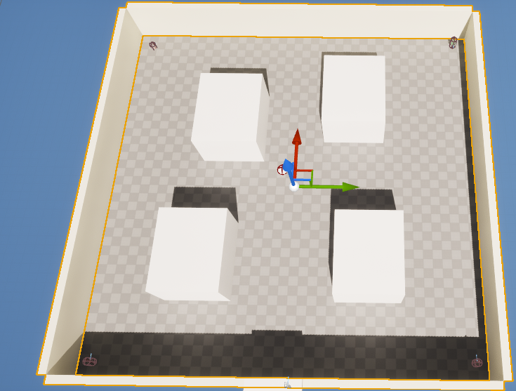

# RLWorld
Unreal Project for my Master's Thesis

## Project Overview:
A decentralized MARL environmetn build in Unreal Engine 5.6 using Learning Agents plugin. the system features multiple pursuers (RL Agent) tasked with intercepting and capturing 1 evader(State Tree AI) before it reaches a goal.

In this Pursuit-evasion game scenario, the pursuer is learnt through Learning Agents plugin and the evader is learnt through State Tree AI. Due to this project focusing on the pursuers' actions, the evader's actions will be limited such that it is predictable.

This test map consists of a square map with 4 walled obstacles. each agents are placed on the corners, pursures colored in red and evader color in green the circular ball in the middle is the goal the evader reaches.

## Key Implmentations

The Learning follow this general implementation: Initialization, observation, completion, and reset

1. Initialization

Agents registers with the LearningAgnetsManager via tagged sarch in BeginPlay

2. Observation

The Interactor gathers relative vectors between pursuers, evader, and the goal as well as perform actions of each pursuers

3. Completion

The Training Environment calculates the threshold of contact between pursuer/evader or evader/goal and triggers a success state.

4. Reset.

The Training Environment loops thgh each agents calling each of their respect reset function to change the starting point.
